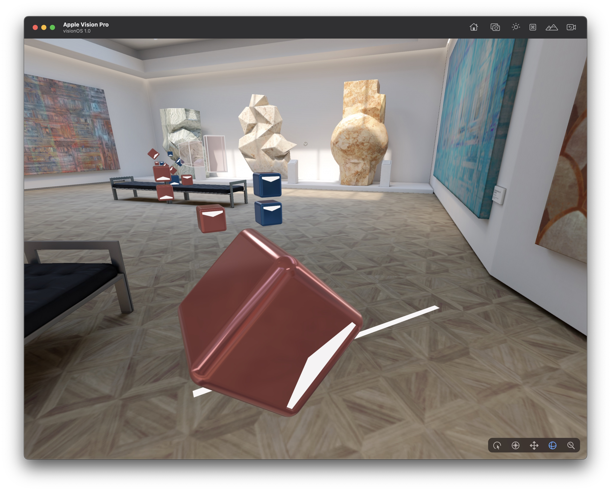
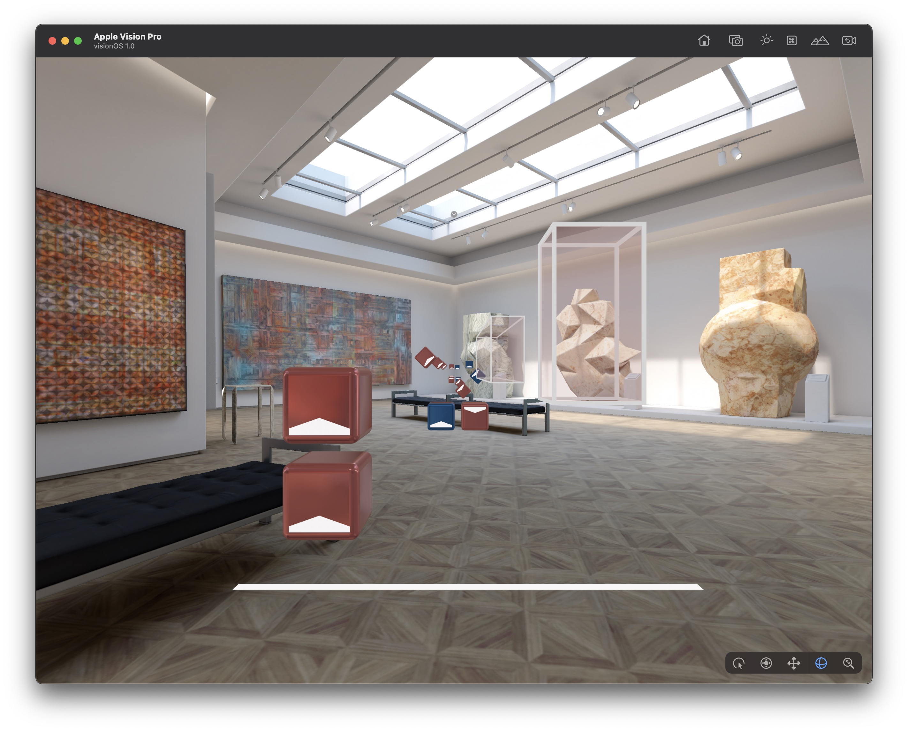

# Beatmap AR for the Apple Vision Pro

Beat Saber map (a.k.a beatmap) visualizer for the Apple Vision Pro. It's the successor of [BeatmapAR](https://github.com/fabio914/BeatmapAR) for iOS.

This app is still a work in progress.

## Screenshots

## Requirements

- [Xcode 15.0 beta 2](https://developer.apple.com/xcode/) or newer with the visionOS SDK 1.0 installed.

## Contributors

[Fabio Dela Antonio](http://github.com/fabio914)

## Credits

This project depends on [weichsel/ZIPFoundation](https://github.com/weichsel/ZIPFoundation).

Its beatmap definition is based on the [lolPants/beatmap-schemas](https://github.com/lolPants/beatmap-schemas).

It also uses the [Beat Saber Cube](https://www.thingiverse.com/thing:3387776) model created by [Jordan Johnston](https://www.thingiverse.com/Godsblade/about).

*This project isn't affiliated with Beat Games nor Beat Saber.*
